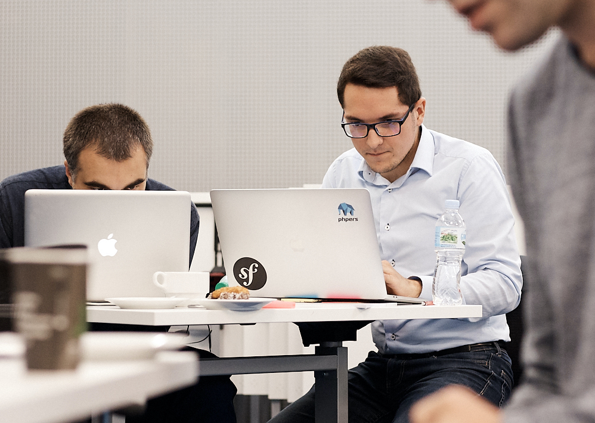

Howdy!

I'm glad you are visiting this site! Describing myself is always tough task but I will do my best ;)

## Currently

I am the proud <strong>Founder</strong> of <a href="https://apprife.com/">Apprife</a> - a software development company focused on delivering quality solutions for our customers. We believe that the biggest value of the company are <strong>people</strong> - only thanks to our talented team we can deliver hight quality projects on time. We are doing our best to provide clients with exceptional software in planned time, but also keeping in mind Developer Experience and stress-free atmosphere. If you want to learn more, visit our website or contact me directly.

Secondly - I'm supporting <a href="https://itcraftship.com">ITCraftship</a> as a <strong>Backend Technical Recruiter</strong>. My main responsibility is to verify CVs, conduct technical interviews and check home assessments.

After hours I am <strong>Leading Development</strong> of <a href="https://alikeme.app">AlikeMe App</a> Start-up. I strongly believe in our idea and you will for sure hear about us in the near future ;)

## Background

For last 6 years I've been working as a Backend Software Developer in many companies. During that time, I managed to work in software houses, start-ups, product companies or even corporations.

Almost all of my career I've been working with PHP and other supporting backend technologies like Docker, AWS or databases like PostgreSQL, MySQL, MongoDB, Elasticsearch, Redis.

One of the most important breakthroughs in my career was joining <a href="https://sylius.com">Sylius</a> as a Software Engineer. My responsibilities were to maintain Sylius Core and develop a new product for Marketplaces that Sylius was about to release. While working there, I understood many of eCommerce concepts and rules that were helpful when I later joined <a href="https://bitbag.io">BitBag</a> to develop eCommerce platforms using Sylius Framework and other PHP related technologies.

I used to work in or for start-ups, participating not only as a Developer but I was also involved in Business roles. As I enjoyed working not only with code but also with business side of the projects, I decided to start my own company.

If you want to learn more about my experience you can visit my <a href="https://linkedin.com/in/konrad-alfaro">LinkedIn profile</a> or my <a href="https://radnok.com/cv.pdf">public CV</a>.

## Private

If I'm not at work, I like to play with my cat and drive cars. You can follow me on <a href="https://instagram.com/radnok_">Instagram</a> to check out what I'm currently into.

Preparing for a pitching competition during a Start-up contest

